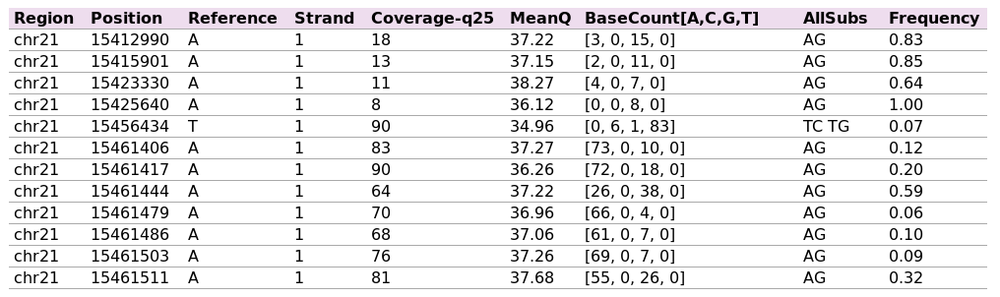
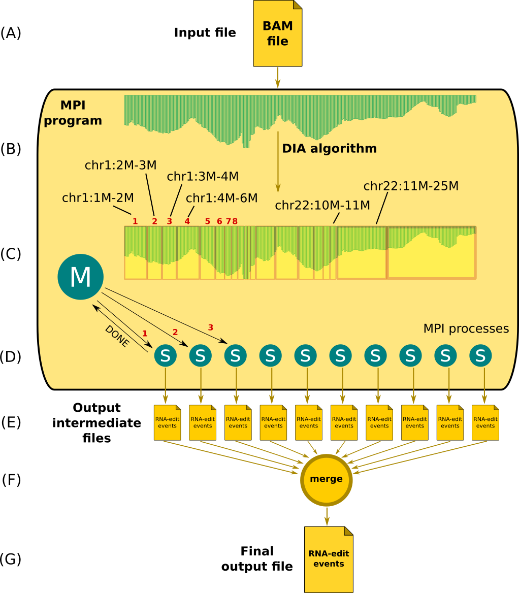
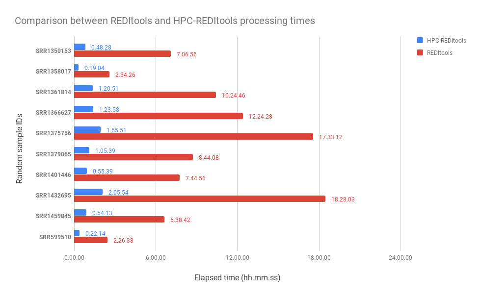

# REDItools2

**REDItools2** is the optimized, parallel multi-node version of [<i class="icon-link"></i> REDItools](https://github.com/BioinfoUNIBA/REDItools).

REDItools takes in input a RNA-Seq (or DNA-Seq BAM) file and outputs a table of RNA-Seq editing events.  Here is an example of REDItools's output:

The following image explains the high-level architecture.

This version of REDItools shows an average 8x speed improvement over the previous version even when using only the serial-mode:

# Index

- [1. Python setup](#1-python-setup)
- [2. Environment setup](#2-environment-setup)
- [3. Cloning / downloading](#3-cloning--downloading)
- [4. Installing](#4-installing)
- [5. The two versions of REDItools 2.0](#5-the-two-versions-of-reditools-20)
  - [5.1 Serial version](#51-serial-version-reditoolspy) 
  - [5.2 Parallel version](#52-parallel-version--parallel_reditoolspy)
- [6. Running REDItools 2.0 on your own data](#6-running-reditools-20-on-your-own-data) 
- [7. REDItools 2.0 options](#7-reditools-20-options) 
- [8. DNA-Seq annotation with REDItools 2.0](#8-dna-seq-annotation-with-reditools-20)
- [9. Running REDItools 2.0 in multisample mode](#9-running-reditools-20-in-multisample-mode)
- [10. Displaying benchmarks in HTML with REDItools 2.0 (parallel version only)](#10-displaying-benchmarks-with-reditools-20-parallel-version-only)

## Installation

### 1. Python setup
---
This guide assumes you have Python <= 2.7 installed in your system. If you do not have Python, please read the [official Python webpage](https://www.python.org/).

Make sure to have the following packages installed:

> sudo apt-get install python-dev build-essential libssl-dev libffi-dev libxml2-dev libxslt1-dev zlib1g-dev python-pip zlib-devel zlib zlib1g zlib1g-devel libbz2-dev zlib1g-dev libncurses5-dev libncursesw5-dev liblzma-dev

Make sure you have you preferred Python version loaded. If you have a single Python version already installed in your system you should do nothing. If you have multiple versions, please be sure to point to a given version; in order to do so check your environmental variables (e.g., PATH).

If you are running on a cluster (where usually several versions are available) make sure to load a given Python version. For example (if running on CINECA Marconi super computer) the following command would load Python 2.7.12:
> module load autoload python/2.7.12

Note: REDItools2.0 has been tested with Python 2.7.12. The software comes with no guarantee of being compatible with other versions of Python (e.g., Python >=3).

### 2. Environment setup
---
Make sure the following libraries are installed:

- htslib (see http://www.htslib.org/download/ and https://www.biostars.org/p/328831/ for instructions)
- samtools:

> sudo apt-get install samtools

- tabix:

> sudo apt-get install tabix

- an MPI implementation. We suggest OpenMPI, but you can choose whatever you like the most. For installing OpenMPI, try the following command:
> sudo apt-get install openmpi-common libopenmpi-dev

### 3. Cloning / Downloading
---

The first step is to clone this repository (assumes you have *git* installed in your system - see the [Git official page](https://git-scm.com/book/en/v2/Getting-Started-Installing-Git) otherwise):
> git clone https://github.com/tflati/reditools2.0.git

(alternatively you can download a ZIP package of REDItools2.0 from [here](https://github.com/tflati/reditools2.0/archive/master.zip) and uncompress the archive).

Move into the project main directory:
> cd reditools2.0

### 4. Installing
---

REDItools 2.0 requires a few Python modules to be installed in the environment (e.g., pysam, sortedcontainers, mpi4py, etc.). These can be installed in three ways:

- **System-level**: in this way the dependencies will be installed in your system and all users in your system will see changes. In order to perform this type of installation you need administrator rights.
To install REDItools2.0 in this modality, just run the following command:
> sudo pip install -r requirements.txt

- **User-level**: in this way the dependencies will be installed only for your current user, usually in your home directory. In order to perform this type of installation you need only to be logged as a normal user. Note that this type of installation will install additional software in your local Python directory (usually $HOME/.local/lib/python2.7/site-packages/, but it depends on your operating system and distribution).
This is the recommended modality if you do not care about altering your user environment. Note that altering your user environment might lead to software corruption. For example, assume you have already the *pysam* package installed (version 0.6); since REDItools 2.0 requires a version for *pysam* >= 0.9, the installation would uninstall the existing version of pysam and would install the version 0.9, thus altering the state of your environment. Any existing software which relied on version pysam 0.6 might break and stop working. In conclusion, choose this modality at your own risk.
To install REDItools2.0 in this modality, just run the following command:
> pip install -r requirements.txt --user
 
- **Environment-level**: in this type of installation you create an isolated virtual environment (initially empty) which will contain any new required software, without creating conflicts with any existing environment or requiring any particular right.
This modality will work regardless of the existing packages already installed in your system (both user and system levels) and thus gives the maximum possible freedom to the final-end user.
This is the recommended modality.
The downside of choosing this modality is a potential duplication of code with respect to other existing environments. For example, assume you already have a given version of *sortedcontainers*; by installing REDItools2.0 at environment-level will download and install a *new* copy of *sortedcontainers* into a new isolated environment (ending up with two copies of the same software present in the system, one inside and one outside the virtual environment).
To install REDItools2.0 in this modality, run the following commands:

> virtualenv ENV
> 
> source ENV/bin/activate
>
> pip install -r requirements.txt
> 
>  deactivate

These commands will create a new environment called *ENV* (you can choose any name you like) and will install all dependencies listed in the file *requirements.txt* into it). The commands *activate* and *deactivate* respectively activate (i.e., start/open) and deactivate (i.e., end/close) the virtual environment.
When running the real commands, remember to wrap your commands between and activate and deactivate commands:

>source ENV/bin/activate
>
>command...
>
>command...
>
>command...
>
>command...
>
>deactivate

## Testing

### 5. The two versions of REDItools 2.0
---

This repo includes test data and a test script for checking that dependencies have been installed properly and the basic REDItools command works.

In order to have all the data you need, run the following commands:

> cd test
>
> ./prepare_test.sh

This will download and index the chromosome 21 of the hg19 version of the human genome (from http://hgdownload.cse.ucsc.edu/downloads.html).
Once the script has finished running, you have all you need to perform the tests.

The software comes with two modalities. Feel free to choose the one which best fits your needs.

####  5.1 Serial version (reditools.py)

In this modality you benefit only from the optimization introduced after the first version. While being significantly faster (with about a 8x factor), you do not exploit the computational power of having multiple cores. On the other hand the setup and launch of REDItools is much easier.
This might be the first modality you might want to give a try when using REDItools2.0 for the first time.

The serial version of REDItools2.0 can be tested by issuing the following command:

> serial_test.sh

or, if you are in a SLURM-based cluster:

> sbatch serial_test_slurm.sh

#### 5.2 Parallel version  (parallel_reditools.py)

In this modality you benefit both from the serial optimization and from the parallel computation introduced in this brand new version which exploits the existence of multiple cores, also on multiple nodes, making it a perfect tool on High Performance Computing facilities.
Using this modality requires you to perform a little bit more system setup, but it will definitely pay you off.

The parallel version leverages on the existence of coverage information which reports for each position the number of supporting reads.

We assume you already have installed and correctly configured the following tools:

- **samtools** (http://www.htslib.org/)
- **htslib** (http://www.htslib.org/)

If you can use *mpi* on your machine (e.g., you are not on a multi-user system and there are no limitations to the jobs you can submit to the system), you can try launching the parallel version of REDItools 2.0 as follows:

> ./parallel_test.sh

If you are running on a SLURM-based cluster, instead, run the following command:

> sbatch ./parallel_test_slurm.sh

This script:
- first defines a bunch of variables which point to input, output and accessory files; then
- launches the production of coverage data; then
- REDItools 2.0 is launched in parallel, by using the specified number of cores; finally
- results are gathered and written into a single table (parameter *-o* provided in the command line)

## Running

### 6. Running REDItools 2.0 on your own data
---
You can now customize the input test scripts to your needs with your input, output and ad-hoc options.

### 7. REDItools 2.0 options
---
#### 7.1 Basic options
In its most basic form, REDItools 2.0 can be invoked with an input BAM file, a reference genome and an output file:
> python src/cineca/reditools.py -f \$INPUT_BAM_FILE -r $REFERENCE -o \$OUTPUT_FILE

If you want, you can restrict the analysis only to a certain region (e.g., only chr1), by means of the **-g** option :
> python src/cineca/reditools.py -f  \$INPUT_BAM_FILE -r $REFERENCE -o \$OUTPUT_FILE -g chr1
> 
or a specific interval:
> python src/cineca/reditools.py -f  \$INPUT_BAM_FILE -r $REFERENCE -o \$OUTPUT_FILE -g chr1:1000-2000

For a complete list of options and their usage and meaning, please type:

> python src/cineca/reditools.py -h

#### 7.2 Other options

Here we report the principal options with a detailed explanation for each of them.
The following are the options accepted by the serial version of REDItools:

> reditools.py [-h] [-f FILE] [-o OUTPUT_FILE] [-S] [-s STRAND] [-a]
                    [-r REFERENCE] [-g REGION] [-m OMOPOLYMERIC_FILE] [-c]
                    [-os OMOPOLYMERIC_SPAN] [-sf SPLICING_FILE]
                    [-ss SPLICING_SPAN] [-mrl MIN_READ_LENGTH]
                    [-q MIN_READ_QUALITY] [-bq MIN_BASE_QUALITY]
                    [-mbp MIN_BASE_POSITION] [-Mbp MAX_BASE_POSITION]
                    [-l MIN_COLUMN_LENGTH] [-men MIN_EDITS_PER_NUCLEOTIDE]
                    [-me MIN_EDITS] [-Men MAX_EDITING_NUCLEOTIDES] [-d]
                    [-T STRAND_CONFIDENCE] [-C] [-Tv STRAND_CONFIDENCE_VALUE]
                    [-V] [-H] [-D] [-B BED_FILE]
  >                    
  > **-h**, --help
  > show this help message and exit
  >
  >**-f** FILE, --file FILE 
  >The bam file to be analyzed
  >
  >**-o** OUTPUT_FILE, --output-file OUTPUT_FILE
  >The output statistics file
  >
  >**-S**, --strict
  >          Activate strict mode: only sites with edits will be included in the output
  >
  >**-s** STRAND, --strand STRAND
  >Strand: this can be 0 (unstranded), 1 (secondstrand oriented) or 2 (firststrand oriented)
  >
  >**-a**, --append-file
  >Appends results to file (and creates if not existing)
  >
  >**-r** REFERENCE, --reference REFERENCE
  >The reference FASTA file
  >
  >**-g** REGION, --region REGION
  >The region of the bam file to be analyzed
  >
  >**-m** OMOPOLYMERIC_FILE, --omopolymeric-file OMOPOLYMERIC_FILE
  >The file containing the omopolymeric positions
  >
  >**-c**, --create-omopolymeric-file
  >Whether to create the omopolymeric span
  >
  >**-os** OMOPOLYMERIC_SPAN, --omopolymeric-span OMOPOLYMERIC_SPAN
  >The omopolymeric span
  >
  >**-sf** SPLICING_FILE, --splicing-file SPLICING_FILE
  >The file containing the splicing sites positions
  >
  >**-ss** SPLICING_SPAN, --splicing-span SPLICING_SPAN
  >The splicing span
  >
  >**-mrl** MIN_READ_LENGTH, --min-read-length MIN_READ_LENGTH
  >The minimum read length. Reads whose length is below this value will be discarded.
  >
  >**-q** MIN_READ_QUALITY, --min-read-quality MIN_READ_QUALITY
  >The minimum read quality. Reads whose mapping quality is below this value will be discarded.
  >
  >**-bq** MIN_BASE_QUALITY, --min-base-quality MIN_BASE_QUALITY
  >The minimum base quality. Bases whose quality is below this value will not be included in the analysis.
  >
  >**-mbp** MIN_BASE_POSITION, --min-base-position MIN_BASE_POSITION
  >The minimum base position. Bases which reside in a previous position (in the read) will not be included in the analysis.
  >
  >**-Mbp** MAX_BASE_POSITION, --max-base-position MAX_BASE_POSITION
  >The maximum base position. Bases which reside in a further position (in the read) will not be included in the analysis.
  >
  >**-l** MIN_COLUMN_LENGTH, --min-column-length MIN_COLUMN_LENGTH
  >The minimum length of editing column (per position). Positions whose columns have length below this value will not be included in the analysis.
  >
  >**-men** MIN_EDITS_PER_NUCLEOTIDE, --min-edits-per-nucleotide MIN_EDITS_PER_NUCLEOTIDE
  >The minimum number of editing for events each nucleotide (per position). Positions whose columns have bases with less than min-edits-per-base edits will not be included in the analysis.
  >
  >**-me** MIN_EDITS, --min-edits MIN_EDITS
  > The minimum number of editing events (per position). Positions whose columns have bases with less than 'min-edits-per-base edits' will not be included in the analysis.
  >
  >**-Men** MAX_EDITING_NUCLEOTIDES, --max-editing-nucleotides MAX_EDITING_NUCLEOTIDES
  > The maximum number of editing nucleotides, from 0 to 4 (per position). Positions whose columns have more than 'max-editing-nucleotides' will not be included in the analysis.
  >
  >**-d**, --debug
  >REDItools is run in DEBUG mode.
  >
  >**-T** STRAND_CONFIDENCE, --strand-confidence STRAND_CONFIDENCE
  > Strand inference type
  > 1:maxValue
  > 2:useConfidence [1];
  > maxValue: the most prominent strand count will be used;
  > useConfidence: strand is assigned if over a prefixed frequency confidence (-TV option)
  >
  >**-C**, --strand-correction
  > Strand correction. Once the strand has been inferred, only bases according to this strand will be selected.
  >
  >**-Tv** STRAND_CONFIDENCE_VALUE, --strand-confidence-value STRAND_CONFIDENCE_VALUE
  >                        Strand confidence [0.70]
  >
  >**-V**, --verbose
  >         Verbose information in stderr
  >
  >**-H**, --remove-header
  >Do not include header in output file
  >
  >**-N**, --dna
  >Run REDItools 2.0 on DNA-Seq data
  >
  >**-B** BED_FILE, --bed_file BED_FILE
  > Path of BED file containing target regions  

The parallel version of REDItools 2.0 has also other 4 additional parameters, namely:
  >**-G**    --coverage-file    The coverage file of the sample to analyze
  >
  >**-D**    --coverage-dir    The coverage directory containing the coverage file of the sample to analyze divided by chromosome
   >
   >**-t**    --temp-dir    The temp directory where to store temporary data for this sample
   >
   >**-Z**    --chromosome-sizes    The file with the chromosome sizes

### 8. DNA-Seq annotation with REDItools 2.0

- Analyze your RNA-Seq data (e.g., file *rna.bam*) with any version of REDItools and obtain the corresponding output table (e.g., *rna_table.txt* or *rna_table.txt.gz*);
- Analyze your DNA-Seq data (e.g., *dna.bam*) with REDItools 2.0, providing as input:
	1. The DNA-Seq file (*dna.bam*) (e.g., option *-f* *dna.bam*);
	2. The output RNA-table output of the first step (e.g., option *-B* *rna_table.txt*)
This step will produce the output table (e.g., *dna_table.txt*);
- Annotate the RNA-Seq table by means of the DNA-Seq table by running REDItools2.0 annotator (script *src/cineca/annotate_with_DNA.py*) with the two tables as input (e.g., *rna_table.txt* and *dna_table.txt*) which will produce the final annotated table (e.g., *final_table.txt*).

When RNA-editing tables are big (e.g., greater than 1GB in gz format) reading the full table in parallel mode can be really a time-consuming task. In order to optimize the loading of target positions, we have provided a script to convert RNA-editing tables to BED files:

> python src/cineca/reditools_table_to_bed.py -i RNA_TABLE -o BED_FILE

This can be further optimized by creating the final BED in parallel:

> extract_bed_dynamic.sh RNA_TABLE TEMP_DIR SIZE_FILE

where
- RNA_TABLE is the input RNA-editing table;
- TEMP_DIR is the directory that will contain the output BED file;
- SIZE_FILE is the file containing the chromosome information (e.g., the .fai file of your reference genome).

Finally run the script *src/cineca/annotate_with_DNA.py*:

> python src/cineca/annotate_with_DNA.py -r RNA_TABLE -d DNA_TABLE [-Z]

The option -Z (not mandatory and without arguments) will exclude positions with multiple changes in DNA-Seq.

#### 8.1 Useful scripts

In order to ease the annotation of RNA-Seq tables with DNA-Seq information, we also provided two sample scripts that you can customize with your own data:

- [**WORK IN PROGRESS**] serial_dna_test.sh
- [**WORK IN PROGRESS**] parallel_dna_test.sh

### 9. [**WORK IN PROGRESS**] Running REDItools 2.0 in multisample mode
REDItools also supports the launch on multiple samples at the same time. This modality is extremely useful if you have a dataset (i.e., group of homogeneous samples) and wish to run the same analysis on all of them (i.e., with the same options).

In order to do this, we provided a second script analogous to parallel_reditools.py, called *reditools2_multisample.py* which supports the specification of an additional option -F [SAMPLE_FILE]. SAMPLE_FILE is a file containing the (absolute) path of samples to be analyzed.
It can be launched in the following manner:

> mpirun src/cineca/reditools2_multisample.py -F $SAMPLE_FILE [OPTIONS]

where OPTIONS are the same options accepted by the parallel version of REDItools 2.0.

 #### 9.1 Running in multisample mode on a SLURM-based cluster
If you wish to run REDItools 2.0 in multisample mode on a SLURM-based cluster, we provided two scripts that will help you:

- [**WORK IN PROGRESS**] *extract_coverage_slurm_multisample.sh*: will calculate the coverage data for all the samples in parallel (by using the script *extract_coverage_dynamic.sh*);
- [**WORK IN PROGRESS**] *multisample_test.sh*: will calculate the RNA-editing events tables for all the samples in parallel using MPI.

First run *extract_coverage_slurm_multisample.sh* and then *multisample_test.sh*.

### 10. Displaying benchmarks with REDItools 2.0 (parallel version only)
We also released simple scripts to generate HTML pages containing the snapshot of the amount of time REDItools 2.0 (parallel version) spends on each part of the overall computation for each process (e.g., coverage computation, DIA algorithm, interval analysis, partial results recombination, etc).

**Note**: this command will work only when launched *after* the parallel computation has completed.

All you have to do to create the HTML page is launching the following command:
> create_html.sh TEMP_DIR

where TEMP_DIR is the directory you specified with the -t option; this directory should contain in fact some auxiliary files (e.g., intervals.txt, progress.txt, times.txt and groups.txt) which serve exactly this purpose.
Once created, the HTML page should display time information similar to the following:

By means of this visualization you can *hover* on slices to see more in details the statistics for each interval computation as well as *zoom in* and *zoom out* by using the scroll wheel of your mouse.

Issues
---
No issues are known so far. For any problem, write to t.flati@cineca.it.
<!--stackedit_data:
eyJoaXN0b3J5IjpbLTIxMzkwMjczOTAsNDc1MjkwNjE2LC0xMD
E2NzQ0MjUxLC0yMDk0OTkwNDIzLC05NjkzNjU4MjIsMjc2NzE0
NTA3LDIxMDkxNjI1NDksLTkxNjY3ODgyMSwxODY3MzQ1NjIzLD
IwNDYwMjY1NzYsLTIwOTcwNDQyMDgsMTE1NDk3NTIxNCwtOTEz
OTQ0ODIzXX0=
-->
